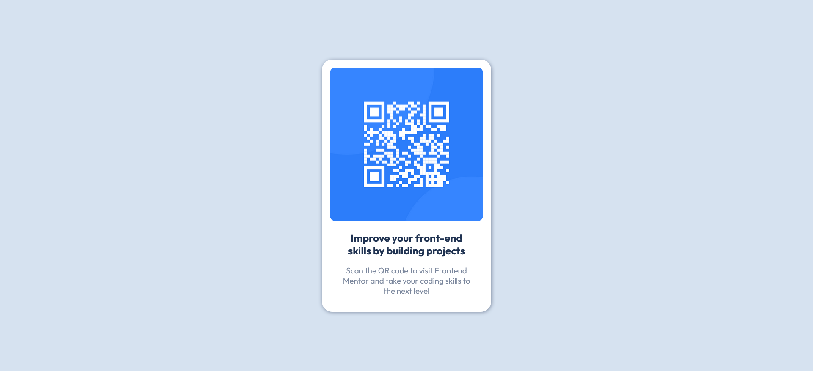

# Frontend Mentor - QR code component solution

This is a solution to the [QR code component challenge on Frontend Mentor](https://www.frontendmentor.io/challenges/qr-code-component-iux_sIO_H). Frontend Mentor challenges help you improve your coding skills by building realistic projects. 

## Table of contents

- [Overview](#overview)
  - [Screenshot](#screenshot)
  - [Links](#links)
- [My process](#my-process)
  - [Built with](#built-with)
  - [What I learned](#what-i-learned)
  - [Continued development](#continued-development)
- [Author](#author)
- [Acknowledgments](#acknowledgments)

## Overview

### Screenshot



### Links

- Solution URL: [Github Repo](https://github.com/fritzadelbertus/FEM_QR-Code-Component)
- Live Site URL: [Github Pages](https://fritzadelbertus.github.io/FEM_QR-Code-Component/)

## My process

### Built with

- Semantic HTML5 markup
- CSS custom properties
- CSS Grid
- Mobile-responsive
- Google Fonts (https://fonts.google.com/specimen/Outfit) - For styles

### What I learned

```html
<link rel="icon" type="image/png" sizes="32x32" href="./images/favicon-32x32.png">
```
```css
@import url('https://fonts.googleapis.com/css2?family=Outfit:wght@400;700&display=swap');
```

### Continued development

CSS:
- Understand more varieties of styling
- Understand css element positioning better
- More fluent in picking grid or flexbox for layouting

## Author

- Website - [Fritz Adelbertus Sitindaon](https://www.furitsu.site)
- Frontend Mentor - [@fritzadelbertus](https://www.frontendmentor.io/profile/fritzadelbertus)

## Acknowledgments

Thank you to FrontEnd Mentor for providing this challenge. Really make me refresh the basic knowledge of HTML and CSS.
